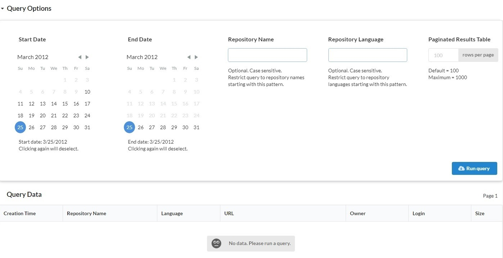
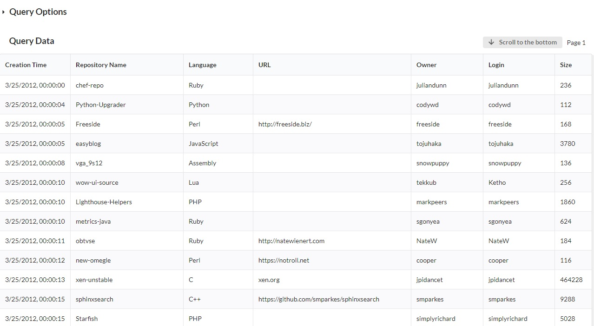

<div align="center">
  <a href="https://github.com/winwiz1/crisp-bigquery">
    
  </a>
  <br />
  <br />
</div>
<br />
<div align="center">
  
  
  
  
</div>

## Project Highlights
Full stack starter solution that delivers Google BigQuery data to your browser. Includes Express backend and React client written in TypeScript. Works with sample GitHub data. The end users interact with the website served by Express,  supply optional search parameters and paginate through BigQuery data.

> Sample website developed using Crisp BigQuery as a starter project: [COVID-19 Query Tool](https://covid.winwiz1.com/). Instead of GitHub dataset it uses Google data made available via [COVID-19 Open Data](https://github.com/GoogleCloudPlatform/covid-19-open-data) repository.

The solution can be used to achieve the following adjectives:
1. Data access.<br/> Suppose you need to make BigQuery data available to a team of analysts/statisticians who rely on you to write SQL statements. You implement it as a parameterised query hardcoded into the backend. The team runs ad-hoc queries by providing optional search criteria, reviews the data, exports and feeds it into the toolset of their choice (Excel, SAS and others).
2. Presentation.<br/>The existing tabular view of data can be complimented by adding charts. Use popular libraries like [Rechart](http://recharts.org/en-US/examples) without customisation restrictions imposed by pre-built dashboards. Exercise complete control over data presentation and optionally integrate with your company website.
3. Security.<br/>The client app running inside a browser doesn't have BigQuery credentials. The backend running in a more trusted environment does have the credentials.<br/>To mitigate threats like SQL injection the input from users is scrutinised by the client app, then additionally on the backend and finally by the BigQuery engine which sees the query is parameterised and scans the query parameters for SQL injection hacks.<br/>The solution can be extended to authenticate users by adding [PassportJS](http://www.passportjs.org/docs/downloads/html/) or other popular library using simple local credential storage or multi-factor industry-standard authentication schemes. Once a user has been authenticated and their personal or group identity established, optionally make authorization decisions to select which query can be accessed by this identity.
4. DevOps and principle of least privilege (PoLP).<br/>In another scenario the stock export of Stackdriver Logging into BigQuery is used to monitor the infrastructure health, it works in nearly real-time. Only one DevOps team would have access to BigQuery Console with other teams getting curated and read-only access via Intranet website to satisfy PoLP.
5. Costs and cost control.<br/>There is no need to provision GCP accounts required to access BigQuery Console, you decide which accounts are required to access the Express based website. The ability to exercise complete control over the underlying queries and their costs is assisted by daily usage quotas imposed on each end user and separately on the website as a whole. Achieving the same can be difficult with pre-built dashboards where even identifying which underlying queries are used might be a challenge amplified by inability to limit the queries count.
6. Volume of data.<br/>The solution allows to fetch up to 200,000 rows of data. E.g. 100 pages of data 2000 rows each. For comparison, as of December 2019, both the connector for Google Sheets and Google connector for Excel have 10,000 rows limitation on data transfer.
7. Data export.<br/>Export the fetched data directly into a local CSV file. Then import into Excel or a statistical package of your choice. There is no need to use cloud storage and provide access to a cloud storage bucket.

>The solution uses data pagination natively supported by BigQuery and is based on the API [documentation](https://cloud.google.com/bigquery/docs/reference/rest/v2/jobs/getQueryResults) and studying the Google [client library](https://github.com/googleapis/nodejs-bigquery) source code since there are no samples utilising such pagination.

## Table of Contents
- [Features](#features)
- [Getting Started](#getting-started) 
- [Usage](#usage)
- [Using Another Dataset](#using-another-dataset)
- [Known Limitations](#known-limitations)
- [License](#license)

## Features
The features include:
* User defined search options with security mitigation aimed at preventing SQL injection.
* Auto-pagination.  After having set the data page size (from the default 100 rows to 2000 rows) you can start new query by auto-paginating in order to fetch the desired number of data pages, up to 100. All data pages are saved in the cache for delay-free browsing. Alternatively start a new query by manually fetching a couple of data pages. Then review the fetched data, ensure the search criteria used is optimal and continue the existing query by auto-paginating.
* Caching. Pagination in forward and backward directions through already fetched data pages is delay-free as data is retrieved from the cache. Starting a new query results in a typical for BigQuery few seconds delay followed by less than a second delay while fetching subsequent data pages.
* Daily data usage limits imposed on each client and on the backend overall. BigQuery provides 1 TB of free data usage per month. There are costs for usage beyond this threshold. The limits help to mitigate a possible attack (targeting the data usage and its costs) and should be used in addition to other protective measures such as user authentication and [custom cost controls](https://cloud.google.com/bigquery/docs/custom-quotas).
* Integration with Travis CI. It runs tests on each commit and the result is reflected by the test badge. The CI tests decrypt an encrypted credential, use it to fetch data from BigQuery and then exercise non-paginated and paginated requests looping through the latter until the end of the data is reached.

## Getting Started
All the steps in this section can be completed in the cloud using a browser. Another option is to use your local development environment and install Google Cloud SDK there.  Both options are described below.

>:bulb: For the browser option you can get the repository cloned and the solution built (with working website you can interact with and query GitHub data) in under 15 min. Admittedly, this timeframe does not include the first step e.g. creating Google cloud account if you don't already have one.

The browser based approach uses Google Cloud Shell which is a free Linux VM. If you take this option then there is no need to install anything so skip the Step 2. If you prefer to use the local development environment instead then do not skip this step and execute all commands locally where the Cloud SDK is installed. You won't need to open the Cloud Shell if you take the second option.

1. **Create Google Cloud Platform (GCP) account and project.**<br/>
Start at [cloud.google.com](https://cloud.google.com/) and click on "Get started for free" button. Google will ask for a credit card that will be used for identification and not for payments. The card won't be charged unless you manually upgrade your account to the paid one which you can do later. If you upgrade, do not forget to setup [custom cost controls](https://cloud.google.com/bigquery/docs/custom-quotas).
  
2. **Install NodeJS and Google Cloud SDK.**<br/>
Download and run a pre-built Node [installer](https://nodejs.org/en/download/). Then install yarn: `npm install yarn -g`<br/>To install Cloud SDK follow instructions on this [page](https://cloud.google.com/sdk/install).

3. **Enable BigQuery API for the project.**<br/>
Go to GCP [API Dashboard](https://console.cloud.google.com/apis/dashboard) and ensure the project created at the Step 1 is selected. Then click on "+ENABLE API AND SERVICES" button at the top of the page. Choose BigQuery API on the subsequent "Welcome to the API Library" page and enable it.

4. **Create a table.**<br/>
Create `samples.github` table optimised for better performance and lower data usage. It will contain GitHub data. In [BigQuery Web UI](https://console.cloud.google.com/bigquery) click on the "Activate Cloud Shell" icon and execute the command in the Cloud Shell:

    ````
    bq query --use_legacy_sql=false --destination_table samples.github --time_partitioning_field created_time --clustering_fields repository_name,repository_language --replace '#standardSQL
    SELECT
    repository_name,
    repository_language,
    repository_size,
    repository_homepage,  
    actor_attributes_login,
    repository_owner,
    TIMESTAMP(created_at) as created_time
    FROM
    bigquery-public-data.samples.github_timeline
    WHERE
    created_at IS NOT NULL AND repository_name IS NOT NULL AND
    repository_language IS NOT NULL and repository_owner IS NOT NULL AND
    repository_size IS NOT NULL AND LENGTH(repository_name) >= 5'
    ````

    The dataset `samples` with the `samples.github` table should be created. Queries against this table will incur significantly lower data usage (*) in comparison with the public dataset we used as the data source. The created dataset takes 286 MB counted towards BigQuery free 10 GB storage allowance.

    > (*) That's because the table we created contains a subset of public data, is partitioned e.g. split internally into daily partitions and the frontend allows only queries with the timeframe up to one week long. It means the BigQuery engine doesn't have to scan the whole table as it can select only few daily partitions which brings down the data usage. The usage depends on the amount of data processed by the BigQuery engine while executing the request and not on the size of the returned data.<br/>
:bulb: For queries covering wider timeframes e.g. years and tables that have small amount of daily data, partitioning into daily partitions could have a [detrimental effect](https://stackoverflow.com/a/58175053) on data usage. On the one hand the engine cannot be selective too much in terms of partitions and on the other hand the minimum partition size could be greater than the amount of daily data thus increasing the volume of disk space processed by the engine.

5. **Change and display the table settings.**<br/>
Execute commands:

    ```
    bq update --require_partition_filter samples.github
    bq show samples.github
    ```

    The first command requires all queries to take advantage of partitioning. The second one shows the table information including the data storage it takes.

6. **Create a service account and give it the permissions to query our dataset.**<br/>
In the following commands:

    ```
    gcloud iam service-accounts create <sa-name> --display-name "<sa-name>" --description "Test SA - delete when not needed anymore"
    gcloud projects add-iam-policy-binding <project-name> --member=serviceAccount:<sa-name>@<project-name>.iam.gserviceaccount.com --role roles/bigquery.jobUser
    ```
 
    replace the placeholders:<br/>
    `<sa-name>` - replace with service account name,<br/>
    `<project-name>` - replace with the project name.

    and execute the commands. The role `bigquery.jobUser` granted by the last command is not enough. Another permission is required and there are two options to add it:
* Grant the `bigquery.dataViewer` role to the service account:

    ```
    gcloud projects add-iam-policy-binding <project-name> --member=serviceAccount:<sa-name>@<project-name>.iam.gserviceaccount.com --role roles/bigquery.dataViewer
    ```

    Then proceed to the next step. Not recommended unless you are using a throw-away project. The drawback of this approach is granting permissions to view all project datasets.
* Take more granular approach (recommended) by allowing the service account to query one dataset only. This is the approach described below.

    Execute the commands:

    ```
    bq show --format=prettyjson samples >/tmp/mydataset.json  
    vi /tmp/mydataset.json
    ```

    Using vi, append the following item to the existing `access` array and replace the placeholders before saving the file:
    
    ```
    ,
    {  
    "role": "READER",  
    "userByEmail": "<sa-name>@<project-name>.iam.gserviceaccount.com"
    }
    ```

    Execute the command to effect the changes for the `samples` dataset:
    
    ```
    bq update --source /tmp/mydataset.json samples
    ```
    
7. **Save the service account credentials.**<br/>
Save the credentials (including the private key) into a disk file `key.json`:

    ```
    gcloud iam service-accounts keys create ~/key.json --iam-account <sa-name>@<project-name>.iam.gserviceaccount.com
    ```
    
8. **Clone the repository and copy the credentials file.**<br/>
To clone the repository to your workstation or Cloud Shell execute:

    ```
    git clone https://github.com/winwiz1/crisp-bigquery.git
    cd crisp-bigquery
    ```

    The current directory has now been changed to the root of cloned repository. Copy the file `key.json` created at the previous step to `./key.json`. If the repository was cloned to a workstation, you can use [SSH](https://cloud.google.com/sdk/gcloud/reference/alpha/cloud-shell/ssh) to connect to Cloud Shell or simply copy and paste the content of the file.

9. **Build, test and run the solution.**<br/>
Edit the file `./server/.env` and add the GCP project ID to it. Then from the repository root execute the command:

    ```
    yarn install && yarn test
    ```

    Assuming the tests finished successfully, execute:

    ```
    yarn start:prod
    ```

    Wait for the message `Starting the backend...` and point your browser to `localhost:3000`. If you used Cloud Shell to build the solution, click on the Web Preview icon instead and change the port accordingly. You should see this page:<br/><br/> 
Click on the "New query" button. The data fetched by the backend should be displayed in the table. You can collapse the "Query Options" section by clicking on its header in the top left corner and paginate through the data using the control at the bottom of the page:<br/><br/> 

    Then try to submit a more restrictive query, for example with lowercase 'c' as the `Repository Name` pattern and uppercase 'C' as the `Repository Language` pattern (do not type quotes).

    Resting the mouse cursor over the page number shows the tooltip with additional information:

## Usage
### Usage Limits
The daily data usage limits are set to 500 MB for each end user and 30 GB for the backend, see the [`BigQueryModelConfig`](./server/src/api/models/BigQueryModel.ts) class. You can turn off the backend limit by setting it to a value much higher than expected and use the custom cost control (per user) instead, it applies to service accounts as well.

The amount of data usage incurred for our GitHub data queries is approximately 4MB for a query with 1 day timeframe. If the query duration is set to 1 week (the maximum that the app allows) then the data usage could be proportionately higher. Note that in order to reflect BigQuery accounting, the usage is rounded up to 10 MB.

>:bulb: Repeating queries could use BigQuery cache and have zero data usage. In fact that is what happens to the usage limit test. It sets the limit low expecting to hit this restriction after few pagination steps. When the test runs in a sequence with other tests it fails because the limit is not reached due to BigQuery reporting back to the backend zero data usage caused by the cache hit. The test disables BigQuery cache in order for it to succeed.

When a user paginates through data in forward direction, each pagination step to the page suggested by the "More data available" message results in one request. Paginating backwards and forwards to the previously fetched pages retrieves the data from the app cache.

### How to Run, Debug, Test and Lint
The recommended ways of running the frontend and the backend (in development and production), testing, debugging and linting are adopted from [Crisp React](https://github.com/winwiz1/crisp-react/) boilerplate. The solution was created from this boilerplate by executing the following commands:
```
git clone https://github.com/winwiz1/crisp-react.git
mv crisp-react crisp-bigquery
```
and editing the SPA configuration file. Accordingly, all the Crisp React [Usage Scenarios](https://winwiz1.github.io/crisp-react/#usage) along with other README sections like [SPA Configuration](https://winwiz1.github.io/crisp-react/#spa-configuration) apply to Crisp BigQuery, subject to minor corrections caused by different SPA names. In order to debug the backend using VS Code, edit its configuration file [`launch.json`](./server/.vscode/launch.json) and set the `GCP_PROJECT_ID` environment variable to your GCP project ID.

## Using Another Dataset
In order to switch to the dataset of your choice follow the steps:

1. Modify the backend by replacing the string literal that contains SQL statement at the bottom of [`BigQueryModel.ts`](./server/src/api/models/BigQueryModel.ts) file. Note the names of the columns you have chosen to select in the statement. Modify the helper methods that alter the SQL statement to include query parameters.
2. Modify the client app by changing the `columns` array in the [`QueryTable.tsx`](./client/src/components/QueryTable.tsx) file to include new columns from the previous step.

>After both steps are completed, the data selected by the new SQL statement is fetched from BigQuery, serialized by the backend and transmitted to the client app that deserializes and renders it.

3. Decide if you want to retain the user's ability to specify search criteria. Then handle the query parameters - either remove it or modify the parameters handling code for both client and backend.
4. Change UI as required. Consider adding more SPAs to the React application. The benefits of this approach are described in the Crisp React project.

Switching to a non-demo dataset presents security challenges. Addressing those is beyond the scope of this README and the solution. However it can be recommended to:
- Follow Express security [best practices](https://expressjs.com/en/advanced/best-practice-security.html).
- Put Express backend behind a proxy (specifically hardened to be exposed to Internet via a firewall) e.g. Nginx. Configure Nginx to host a WAF.
- Address the Known Limitations below.
- Setup custom cost control for BigQuery.
- Implement robust user authentication (multi-factor and/or other advanced form depending on your security requirements). The limit on data usage should be tied to the end user identity established by authentication rather than the client's address.

## Known Limitations
1. The implementation of data usage limits is meant to be augmented by adding a persistent storage support. In the current implementation the data usage counters are kept in memory and the counter values are lost when the backend restarts. It makes the current data usage control not useful in cases when the backend is frequently restarted. For example, when it is containerised and deployed to a Kubernetes cluster where pods can be short-lived and restarted very frequently, especially if there is a problem with the run-time environment like a memory pressure.

    To mitigate this problem, provide an implementation for the `PersistentStorageManager` class in the [`storage.ts`](./server/src/utils/storage.ts) file.

    >The current implementation will need to be further changed if you intend to run multiple backend instances e.g. via a load balancer.

    Another issue, though less critical, is that the data usage counters are reset not at midnight but after 24 hours since counter creation.

2. BigQuery imposes a limit on the number of concurrent interactive queries per project. The limit is set to 100 concurrent queries and can be changed upon request. The backend can potentially hit this limit depending on the number of end users and backend instances. The current implementation will return an error straight away.

3. All data received from the backend is cached by the app and there is a limit of 200,000 cached rows of data. Once this limit is reached, the end user will receive an error message. In this case the user can either paginate backwards or submit a new query which clears the cache.

4. Export to CSV file is available for Chrome only.
## License
Crisp BigQuery is open source software [licensed as MIT](./LICENSE).

